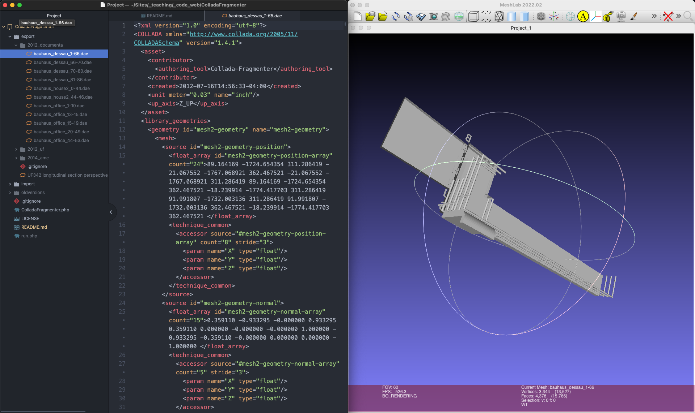

# ColladaFragmenter





## Description

Parse a 3D COLLADA (.dae) file and export a set number of geometries as new COLLADA (.dae) files.


## Requirements

PHP 5.3+ recommended, SimpleXML support required

I recommend you run this application from the command line if possible.
The difference in speed is dramatic. For example...

```bash
$ php file.php
```

## Usage

To run, import the file, create an instance, and fragment

```php
$cf = new ColladaFragmenter();
$cf->fragment($importfile, 44, 53, true, false, $exportdir);
```

To view exported files, use [MeshLab](https://www.meshlab.net/)


## Credits

ColladaFragmenter by Owen Mundy owenmundy.com

[Read more about the process](https://owenmundy.com/blog/2012/08/packet-switching-colladafragmenter/)
